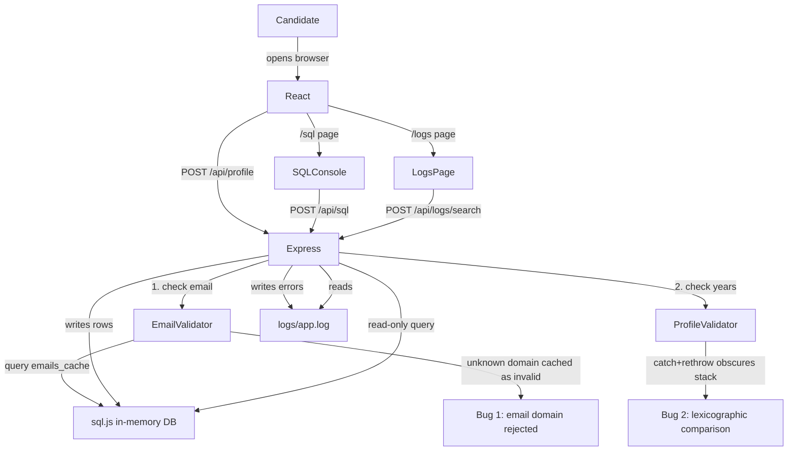

# TSE tech challenge app

## Architecture



## Cross-platform compatibility

| Concern | Solution |
|---|---|
| Native compilation | `sql.js` (pure WebAssembly) instead of `better-sqlite3` — no build tools needed |
| `grep` (Unix-only) | `/logs` search page in the app — works in any browser on any OS |
| Shell scripts | npm scripts only, no `.sh` files |
| File paths | `path.join()` everywhere in Node — no hardcoded `/` separators |
| Node version | 18+ required (LTS, available on Mac + Windows) |

## Repo structure

Single `package.json` at root. Vite proxies `/api/*` to Express, so there's only one port and zero CORS setup.

```
tse-tech-challenge/
├── README.md
├── package.json          # all deps in one place, one npm install
├── vite.config.js        # proxy: /api/* → localhost:3001
├── index.html
├── src/                  # React frontend
│   ├── main.jsx
│   ├── App.jsx
│   ├── pages/
│   │   ├── RegisterPage.jsx   # registration form
│   │   ├── SqlPage.jsx        # /sql console UI
│   │   └── LogsPage.jsx       # /logs search UI
│   └── components/
│       └── ErrorBanner.jsx    # shows generic message + UUID
└── server/
    ├── index.js              # Express app, central error handler
    ├── routes/
    │   ├── profile.js        # POST /api/profile (calls both validators)
    │   ├── sql.js            # POST /api/sql (read-only query runner)
    │   ├── logs.js           # POST /api/logs/search (UUID log lookup)
    │   └── analytics.js      # GET /api/analytics → 404 (red herring)
    ├── services/
    │   ├── emailValidator.js     # Bug 1: email domain cache lookup
    │   └── profileValidator.js  # Bug 2: lexicographic years comparison
    ├── db/
    │   └── init.js           # sql.js in-memory DB: creates tables + seeds data
    └── logs/                 # git-ignored, created on start
        └── app.log           # JSON-line log output
```

## Bug 1 — email domain cache (leads candidate to SQL)

Located in `server/services/emailValidator.js`. When a signup is submitted, the validator extracts the email domain and looks it up in the `emails_cache` table. If the domain is not found, it inserts it as `invalid` with `reason = 'domain not in approved list'` and immediately throws.

```js
// emailValidator.js
function validateEmailDomain(db, email) {
  const domain = email.split("@")[1];
  const cached = db.exec(`SELECT valid, reason FROM emails_cache WHERE domain = '${domain}'`);

  if (!cached[0]?.values?.length) {
    // Bug: unknown domains are cached as invalid instead of being allowed through
    db.run(`INSERT INTO emails_cache (domain, valid, reason, checked_at)
            VALUES ('${domain}', 'invalid', 'domain not in approved list', datetime('now'))`);
    throw new ValidationError(`Email domain '${domain}' is not approved`);
  }

  const [valid, reason] = cached[0].values[0];
  if (valid === "invalid") throw new ValidationError(`Email domain rejected: ${reason}`);
}
```

**Trigger**: Submit with any email whose domain isn't pre-seeded in `emails_cache` as `valid`. The domain gets cached as `invalid` immediately. The candidate can see this in the `/sql` console.

**What the candidate does**: Queries `emails_cache`, finds their domain, sees `valid = 'invalid'` with a reason. Reads the `emailValidator.js` code. Identifies that unknown domains are blacklisted instead of allowed. This is a real bug, but not the primary root cause.

**Fix**: Unknown domains should default to `valid`, or the cache should only store verified-invalid domains.

---

## Bug 2 — lexicographic years comparison (root cause, obfuscated stack trace)

Located in `server/services/profileValidator.js`. The years of experience check runs only after the email validation passes (use a pre-seeded valid domain like `velora.com` to get here). The comparison is lexicographic and the stack trace is deliberately obscured by a catch+rethrow.

```js
// profileValidator.js
function validateYearsExperience(yearsExperience) {
  try {
    // Bug: string comparison. "10" < "2" → true. Throws for any value ≥ 10.
    if (yearsExperience < "2") {
      throw new Error("Minimum 2 years of experience required");
    }
  } catch (e) {
    // Rethrow creates a new Error — original stack frame is lost.
    // Logged stack trace points here (line 9), not to the comparison (line 4).
    throw new ValidationError(e.message);
  }
}

// Fix: parseInt(yearsExperience, 10) < 2
```

**Trigger**: Use a pre-seeded valid domain email (e.g. `test@velora.com`) and enter `10` or more years of experience. Values 2–9 succeed; 10+ all fail.

**Stack trace**: Points to the `throw new ValidationError` line (the rethrow), not to the `if` comparison. The candidate has to read the catch block to realise the stack is from a rethrow, then look up to find the actual comparison.

**Stack trace path**: `routes/profile.js` → `services/profileValidator.js` (rethrow line, not the comparison) — candidate must read code, not just follow the trace.

## Registration form fields

- Full name
- Email
- Password
- Years of experience (the bug field)

## Database schema (sql.js, in-memory)

Three tables. `signups` and `debug_events` are joinable by `signup_id`. `emails_cache` is standalone. All seeded fresh on each server start.

```sql
CREATE TABLE signups (
  id           INTEGER PRIMARY KEY AUTOINCREMENT,
  signup_id    TEXT NOT NULL,          -- shared key with debug_events
  name         TEXT,
  email        TEXT,
  years_exp    TEXT,                   -- stored as-is (string), intentional
  created_at   DATETIME DEFAULT CURRENT_TIMESTAMP
);

CREATE TABLE debug_events (
  id           INTEGER PRIMARY KEY AUTOINCREMENT,
  signup_id    TEXT NOT NULL,
  error_uuid   TEXT,                   -- the UUID shown in the UI
  event_type   TEXT,                   -- e.g. 'email_validation_error', 'years_validation_error'
  payload      TEXT,                   -- JSON: stack trace, raw field values
  metadata     TEXT,                   -- nullable (red herring: looks missing)
  created_at   DATETIME DEFAULT CURRENT_TIMESTAMP
);

CREATE TABLE emails_cache (
  id           INTEGER PRIMARY KEY AUTOINCREMENT,
  domain       TEXT NOT NULL UNIQUE,
  valid        TEXT NOT NULL,          -- 'valid' or 'invalid'
  reason       TEXT,                   -- e.g. 'domain not in approved list'
  checked_at   DATETIME DEFAULT CURRENT_TIMESTAMP
);
```

Seed data for `emails_cache` (a handful of pre-approved domains):

```sql
INSERT INTO emails_cache (domain, valid, reason) VALUES
  ('velora.com',   'valid',   'internal domain'),
  ('acme.com',     'valid',   'approved partner'),
  ('example.com',  'invalid', 'reserved domain per RFC 2606'),
  ('test.com',     'invalid', 'blocked test domain');
```

Candidate queries (two stages):

```sql
-- Stage 1: find the error event by UUID
SELECT s.name, s.email, s.years_exp, d.event_type, d.payload
FROM debug_events d
JOIN signups s ON d.signup_id = s.signup_id
WHERE d.error_uuid = '<uuid from UI>'
LIMIT 10;

-- Stage 2: inspect the email domain cache
SELECT * FROM emails_cache ORDER BY checked_at DESC;
```

## Logging

`logs/app.log` — one JSON line per event:

```json
{"timestamp":"...","level":"ERROR","error_uuid":"abc-123","message":"Validation failed","stack":"ValidationError: Minimum 2 years...\n    at validateProfile (services/profileValidator.js:14)...","signup_id":"xyz-456"}
```

Candidates search via the `/logs` page in the app (paste UUID → see matching entries). Mac/Linux candidates can also use `grep "abc-123" logs/app.log` as a power-user option, noted in the README.

## Candidate investigation flow

Two-stage debugging exercise:

```
Stage 1 — email bug
  Submit form with any email (e.g. user@gmail.com) + 10 years
  → Error + UUID shown in UI
  → /logs: find error_uuid, see "email domain not approved"
  → /sql: query emails_cache, see gmail.com cached as 'invalid'
  → Read emailValidator.js: find unknown domains default to invalid
  → Conclusion: real bug, but not the primary root cause

Stage 2 — years bug (after switching to an approved domain)
  Submit with test@velora.com + 10 years
  → New error + new UUID
  → /logs: find error_uuid, see stack trace pointing to rethrow line
  → Read profileValidator.js: notice catch+rethrow, then look up at the comparison
  → Find "10" < "2" lexicographic comparison
  → Conclusion: primary root cause
```

## Red herrings

- **Console warning**: Frontend calls `console.warn("DeprecationWarning: legacyFormMode is deprecated")` on every submit. Looks alarming in DevTools, totally harmless.
- **Network 404**: `App.jsx` fires a `fetch("/api/analytics")` on mount. The route doesn't exist. Shows up as a red 404 in the DevTools network tab.
- **Misleading log line**: Every submission logs `[WARN] optional field 'referralCode' not provided` — looks like a validation warning, but it's always emitted and unrelated to the error.
- **Nullable metadata**: `debug_events.metadata` is NULL on all error rows. Looks like missing context but is by design.

## Setup (candidate experience)

Works identically on Mac and Windows:

```bash
git clone <repo>
cd tse-tech-challenge
npm install     # one install, ~20s, no native compilation
npm run dev     # starts everything on localhost:5173
```

Candidate tools available at:
- `localhost:5173` — registration form
- `localhost:5173/logs` — log search by UUID
- `localhost:5173/sql` — SQL console

## Dependencies

- **Runtime**: `express`, `sql.js`, `uuid`, `cors` (~4 server packages)
- **Dev/build**: `vite`, `@vitejs/plugin-react`, `react`, `react-dom`, `react-router-dom`, `concurrently`
- **No native compilation required**
